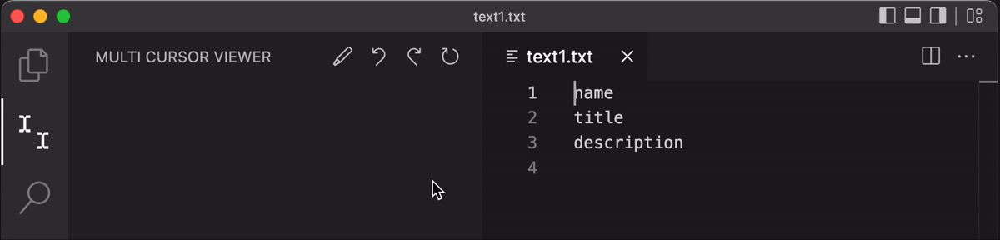

# Multi Cursor Viewer

Display and manipulate multiple cursor in sidebar.

## Features

When multi-cursor, a list of cursors is displayed in the sidebar. The cursors in the list can be manipulated with the remove and move buttons.


### Remove cursor


### Move cursor
Each cursor can be moved individually.


### Replace 
Replace with selected text(`$1`).


Replace with sequential number(`$$`).


## Settings

This extension contributes the following settings:

- `multi-cursor-viewer.autoCommandMultiCursor`
  - Set command ID to be executed automatically when changes from single cursor to multi cursor
- `multi-cursor-viewer.autoCommandSingleCursor`
  - Set command ID to be executed automatically when changes from multi cursor to single cursor

### Example Settings
The following settings automatically open `Multi Cursor Viewer` sidebar when multi cursor.

```
"multi-cursor-viewer.autoCommandMultiCursor": "workbench.view.extension.multi-cursor-viewer"
```


