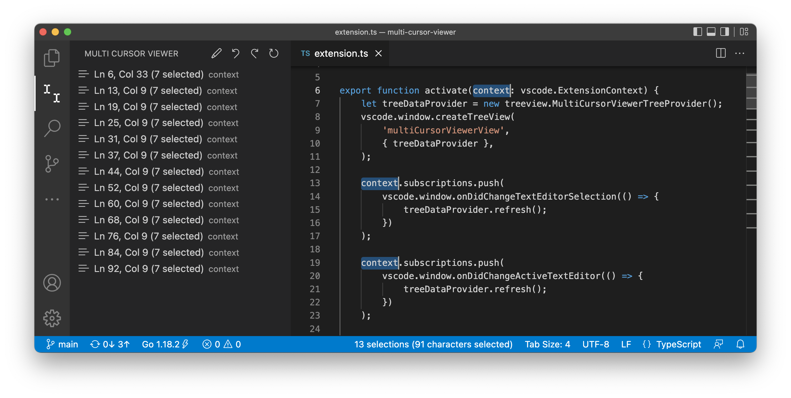
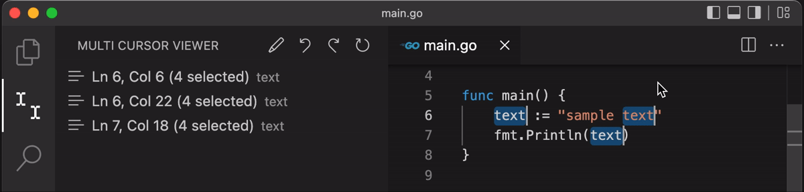

# Multi Cursor Viewer

Display and manipulate multiple cursor in sidebar.

## Features

When multi-cursor, a list of cursors is displayed in the sidebar. The cursors in the list can be manipulated with the remove and move buttons.

### Remove cursor
Cursor can be deleted later.

### Move cursor
Each cursor can be moved individually.

### Replace 
Replace with selected text(`$1`).

Replace with sequential number(`$$`).

